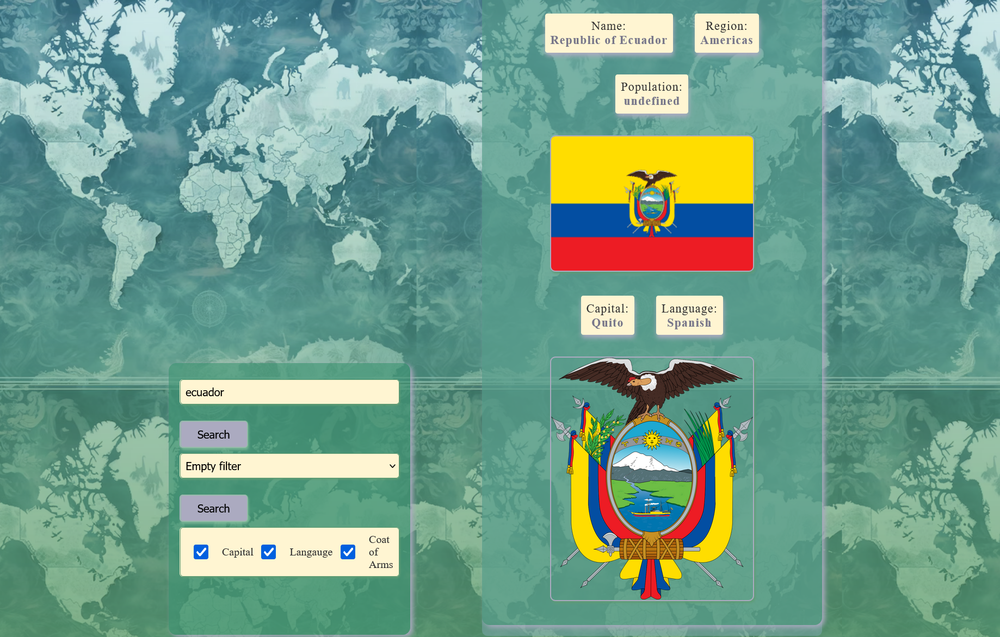

# Buscador de Paises



En este proyecto puedes buscar paises mediante su nombre o sus propiedades, esto es gracias al uso de APIs, la página contiene apartado para mostrar a primera vista todos los paises con su nombre oficial, bandera, región y cantidad de habitantes ademas de un simple filtro de seleccion.

###  [👀 Miralo aquí](https://arm4nd7.github.io/Buscador-Paises-PuArWe-4/)

##  Partida 🚀
En este proyecto puedes encontar:

    ▫️ Contenedor que muestra todos paises al cargar la página.
    ▫️ Contenerdor lateral izquierdo con: 
        - Cuadro de busqueda
        - Seleccion de continentes
        - Checkbox de propiedades adicionales.
    ▫️Busqueda dinámica.
    ▫️Tarjetas de paises con informacion relevante pre-establecida.

## Construido con 🛠️

✔️ `HTML 5` para dar estructura a la página.<br>
✔️ `CSS` para dar estilo a la página y los componentes.<br>
✔️ `JS Vanilla` para dar dinamismo e interactividad a la página.<br>
✔️ `RestCountries API` API para obtener los datos de paises.<br>
✔️ `Material Design` uso de coleres y estilos.

## Como funciona❓
La página tiene tres partes a la vista.
1. Titulo.
2. Cuadro de busuqeda.
3. Muestra de datos.

Nos centraremos en los putnos 1 y 2.
### 1️⃣
En este apartado encontraras tres filtros: 
1. **Para busqueda dinamina:** miestras escribes muestra los paises.
2. **filtro de continentes:** muesta los paises que se encuentra en ese continente.
3. **Checkbox:** muestra otro dato adicional a la tarjeta como capital, lenguaje o escudo.
### 2️⃣
En este apartado escontraras la muestra de los datos:
* Carga de todos los paises.
* Muestra de tarjeta individual al hacer el filtro.

## 🏗️ Estrucutra
```
CountrySearch/
├── src/
│   ├── index.html          # Estructura de página
│   ├── styles.css          # Estilos y diseño
│   └── script.js           # Dinamismo y lógica.
├── package-lock.json
├── package.json
└── README.md               # Documentacion
```

## Gratitud 🎁
* Gracias a [👀 RestCountries API](https://restcountries.com/v3.1/all) para el uso de los datos.
* Gracias [👀 Material Design](https://m2.material.io/design/color/the-color-system.html) para el uso de los estilos y colores.
